# Vision RAG System - Architecture

## System Overview

## Data Flow - Document Processing

```mermaid
sequenceDiagram
    actor User
    participant UI as Streamlit UI
    participant Proc as PDF Processor
    participant VA as Vision Analysis
    participant Provider as OpenAI Provider
    participant LLM as GPT-5 API
    participant Store as Document Store
    participant FS as File System

    User->>UI: Upload PDF
    UI->>Proc: process(pdf_path)
    
    Proc->>Proc: Generate doc_id
    Proc->>FS: Create directories
    
    loop For each page
        Proc->>Proc: Render page to image
        Proc->>Proc: Optimize & resize
        Proc->>FS: Save page_N.jpg
    end
    
    Proc->>UI: Return Document object
    
    UI->>VA: analyze_document(doc)
    
    loop For each page
        VA->>Provider: process_multimodal_messages<br/>(image + prompt)
        Provider->>Provider: Encode image to base64
        Provider->>LLM: Vision API call
        LLM->>Provider: Page summary
        Provider->>VA: Summary + cost
        VA->>VA: Update page.summary
    end
    
    VA->>Store: save_document_metadata()
    Store->>FS: Write metadata.json
    Store->>FS: Update index.json
    
    VA->>UI: Document analyzed ✓
```

## Data Flow - Question Answering

## Component Architecture

## Storage Structure

## Cost Optimization Strategy

## Agent Decision Flow

## Key Design Patterns

### 1. **Factory Pattern**
- `ProcessorFactory` creates appropriate document processors
- `ProviderFactory` creates LLM provider instances

### 2. **Strategy Pattern**
- `BaseProvider` interface allows swapping LLM providers
- Different processing strategies for different file types

### 3. **Repository Pattern**
- `DocumentStore` abstracts storage operations
- Clean separation between business logic and persistence

### 4. **Two-Phase Optimization**
- Phase 1: Cheap text analysis for filtering
- Phase 2: Expensive vision analysis on selected pages
- Result: 80-90% cost reduction

### 5. **Async/Await**
- All I/O operations are async
- Better performance for API calls and file operations

## Technology Stack

## Performance Characteristics

| Operation | Time | Cost | Notes |
|-----------|------|------|-------|
| PDF Processing | ~2-5s/page | $0 | Local operation |
| Page Analysis | ~3-8s/page | ~$0.01/page | Vision API call |
| Page Selection | ~1-2s | ~$0.001 | Text-only API call |
| Question Answer | ~5-15s | ~$0.02-0.05 | Depends on pages selected |

## Scalability Considerations

- **Horizontal**: Multiple documents processed independently
- **Caching**: Page summaries cached after first analysis
- **Cost Control**: Smart page selection reduces API costs
- **Storage**: Efficient JPEG compression for images
- **Async**: Non-blocking I/O for better throughput

